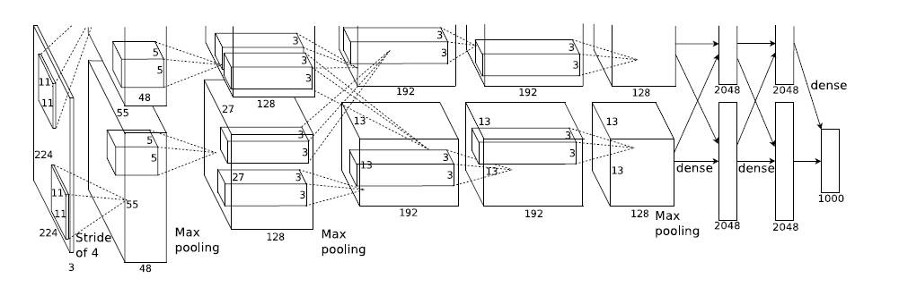
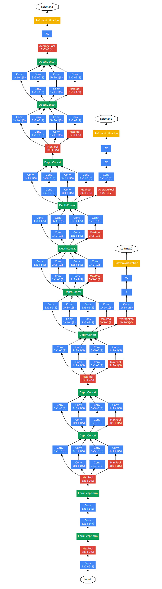

# From LeNet to DenseNet  
借着这次分享就回顾一下CNN网络的发展过程。主要是下面几个：
 - [LeNet](http://yann.lecun.com/exdb/publis/pdf/lecun-98.pdf)
 - [AlexNet](https://www.nvidia.cn/content/tesla/pdf/machine-learning/imagenet-classification-with-deep-convolutional-nn.pdf)
 - [VGG](https://arxiv.org/pdf/1409.1556.pdf)
 - [GoogleNet](https://arxiv.org/pdf/1409.4842.pdf)
 - [ResNet](https://arxiv.org/pdf/1512.03385.pdf)
 - [DenseNet](https://arxiv.org/pdf/1608.06993.pdf)  
接下来就直接开始，主要介绍网络结构和特点，详细的可以去看相关的paper,paper的名字处已放了链接。
## LeNet
作为CNN的开端，这篇paper有四十多页，有很多都在讲神经网络和CNN的基础，并且因为这篇是1998年的paper，距今已经20年，很多的术语也和现在不一样了，所以并不太建议去读这篇paper。先来看一下这个网络的结构  
  
这个网络是十分简单的，一共有三层卷积和两层subsampling，最后再加两层全连接。这里先介绍一下这个subsampling，这个从网络中看很像现在的池化，但是并不是，他是将四个像素点加起来乘一个权重，再加一个偏差。下面计算一下相对应的层的feature map的大小：
```
因为这个网络应用的数据集是手写数字识别，所以输入是32*32，输出是10
input  # 32*32
conv1: feature map 6 kernel 5*5 stide 1 padding 0 # 6*28*28
subsampling2 2*2 # 6*14*14
conv3: feature map 16 kernel 5*5 stide 1 padding 0 # 16*10*10
subsampling4 2*2 # 16*5*5
conv5: feature map 120 kernel 5*5 stide 1 padding 0 # 120*1*1
fc6: 84 # 84
fc7: 10 # 10
output  # 10
```
## AlexNet
如果前面的LeNet是证明了CNN是有作用的话，那么这篇就是CNN大显身手的时候了，这个网络赢得了2012年的ImageNet的冠军，并且与传统的方法了拉开了很大的差距，从此图像分类问题基本就是CNN的天下了，下面从两点来剖析AlexNet，一个是绕不开的网络结构，还有一个是作者在这个网络中用的新的技术。  

这里论文标注的输入是224\*224，但是在第一层计算就不对了，经查应该是227\*227. 还有一点是原网络是因为显存不够，所以将feature map 分开训练的，但是这里在写的时候就不分开了。在池化等等的地方还有很多的问题。这张图基本可以说是错的。
```
参看了网上很多人的分析，比较可信的网络是这样的
input  # 3*227*227
conv1: feature map 96 kernel 11*11 stide 4 padding 0 # 96*55*55
maxpool:  kernel 3*3 stride  2  # 96*27*27
conv2: feature map 256 kernel 5*5 stide 1 padding 2 # 256*27*27
maxpool:  kernel 3*3 stride  2  # 256*13*13
conv3: feature map 384 kernel 3*3 stide 1 padding 1 # 384*13*13
conv4: feature map 384 kernel 3*3 stide 1 padding 1 # 384*13*13
conv5: feature map 256 kernel 3*3 stide 1 padding 1 # 256*13*13
maxpool:  kernel 3*3 stride  2  # 256*6*6
fc: 4096 # 4096
fc: 4096 # 4096
fc: 1000 # 1000
output  # 1000
```
下面也贴一下pytorch官方的库的alexnet的代码，仅供参考：
```python
nn.Conv2d(3, 64, kernel_size=11, stride=4, padding=2),
nn.ReLU(inplace=True),
nn.MaxPool2d(kernel_size=3, stride=2),
nn.Conv2d(64, 192, kernel_size=5, padding=2),
nn.ReLU(inplace=True),
nn.MaxPool2d(kernel_size=3, stride=2),
nn.Conv2d(192, 384, kernel_size=3, padding=1),
nn.ReLU(inplace=True),
nn.Conv2d(384, 256, kernel_size=3, padding=1),
nn.ReLU(inplace=True),
nn.Conv2d(256, 256, kernel_size=3, padding=1),
nn.ReLU(inplace=True),
nn.MaxPool2d(kernel_size=3, stride=2),
nn.Dropout(),
nn.Linear(256 * 6 * 6, 4096),
nn.ReLU(inplace=True),
nn.Dropout(),
nn.Linear(4096, 4096),
nn.ReLU(inplace=True),
nn.Linear(4096, num_classes),
```
虽然上面的网络的结构在小细节方面上有些差别，但是大部分上还是比较类似的，网络不深，一般是卷积和最大池化相结合。下面说一这个网络在细节上的优化和新提出的方法。
### ReLU
首先是激活函数的变化，激活函数从原来的Sigmoid变为了Relu，这是一个很重要的变化，因为原来的sigmoid是有问题的，因为在x很小或者很大的时候，这个函数基本是平的，也就是说，在各部分是没有梯度的，这很不利于计算，而Reul在正的方向导数是1，不需要担心梯度消失的问题。实验也说明Relu的效果很好，并且可以看到在后面的很多的模型中，激活函数都用的Relu。当然他也有缺点，主要的缺点是在负的时候，直接为零，所以就有了leaky-Relu等等一系列的来解决Relu在负半轴dead的问题。
### DropOut
在这个神经网络里面也使用了dropout的方法，来防止过拟合和加速训练。
### Local Response Normalization
翻译为局部响应归一化，这个东西在VGG的论文中认为没用，在其他的论文里也没有使用，但是这个有点难理解，还是详细介绍一下，虽然感觉是已经被抛弃的方法。首先看公式：  
  
公式看起来很复杂，我们再看一下tensorflow的官网的[手册](https://www.tensorflow.org/api_docs/python/tf/nn/local_response_normalization)
```python
tf.nn.local_response_normalization(
    input,
    depth_radius=5,
    bias=1,
    alpha=1,
    beta=0.5,
    name=None
)
# 下面是具体的计算
sqr_sum[a, b, c, d] =
    sum(input[a, b, c, d - depth_radius : d + depth_radius + 1] ** 2)
output = input / (bias + alpha * sqr_sum) ** beta
```
先来解释一下，输入是四维向量，batch，w，h，c，我们要做的是将不同的feature map的相对应的相同位置的周围几个平方和，再乘以系数加上偏差，再beta次方，最后作为这个像素的分母。按照官方给的默认参数，我们大致可以认为这个相当于当一个像素相比较周围大时，经过LRN后也大，小的话也小。再放一张图方便理解，（图来自[这里](https://blog.csdn.net/sinat_21585785/article/details/75087768)，侵删）  
   
## VGG
VGG可以说是非常经典的模型了，到现在也有很多的应用在使用这个模型。这个模型的主要思想就是把网络给做深，同时使用小的卷积核来代替原来的大的卷积核，VGG只使用了3*3的卷积核，并且使用了padding为1.具体的结构可以看下面这张图：  

我们这里就只分析19层的：
```
input 3*224*224
conv1_1 64  3*3  1  1 #64*224*224
conv1_2 64  3*3  1  1 #64*224*224
maxpool 2*2 2         #64*112*112
conv2_1 128  3*3  1  1 #128*112*112
conv2_2 128  3*3  1  1 #128*112*112
maxpool 2*2 2         #128*56*56
conv3_1 256  3*3  1  1 #256*56*56
conv3_2 256  3*3  1  1 #256*56*56
conv3_3 256  3*3  1  1 #256*56*56
conv3_4 256  3*3  1  1 #256*56*56
maxpool 2*2 2         #256*28*28
conv4_1 512  3*3  1  1 #521*28*28
conv4_2 512  3*3  1  1 #521*28*28
conv4_3 512  3*3  1  1 #521*28*28
conv4_4 512  3*3  1  1 #521*28*28
maxpool 2*2 2         #512*14*14
conv5_1 512  3*3  1  1 #521*14*14
conv5_2 512  3*3  1  1 #521*14*14
conv5_3 512  3*3  1  1 #521*14*14
conv5_4 512  3*3  1  1 #521*14*14
maxpool 2*2 2         #512*7*7
fc 4096                #4096
fc 4096                #4096
fc 1000                #1000
output #1000
```
VGG主要的特点就是深和连续的小卷积核，同时应该注意到小卷积核的连续组合在感受野方面是相当于一个大的卷积核的，打个比方，两层3\*3的其实相当于一个5\*5的。
### VGG存在的问题
按照我自己使用的结果和论文的描述，VGG是很难训练的，我还记得的自己按照模型写的VGG在训练的时候刚开始loss根本不下降，因为网络是在是太深了，这里引用论文里的一句话：
> The initialisation of the network weights is important, since bad initialisation can stall learning due
to the instability of gradient in deep nets.  

而论文的训练方法是随机初始化，然后从最简单的11层的训练，再一点一点的添加训练后面的更深的网络(想想我当时直接训练19层，真是太天真了)。论文里还提到另一篇做初始化的论文，说使用上面的初始化可以解决问题，这里提一下[论文地址](http://proceedings.mlr.press/v9/glorot10a/glorot10a.pdf?hc_location=ufi)  
总结一下，我认为除了难训练，全连接层参数量比较大外，VGG还是一个很不错的模型。
## GoogleNet
VGG的特点是将网络做深，而GoogleNet的思想是不仅要深，而且还要将网络横向拓展，于是就出现了inception这个结构，下面先来讲一下这个结构，先来看一下结构：  
  
先看上面的一部分，这部分的原理是分别使用1\*1，3\*3,5\*5，和pool对上一个feature map进行卷积，注意3\*3的时候需要paddingw为1,5\*5为2，pool也是，这样开可以保证在卷积或者pool的时候出来的feature map是一样大的，接下来就可以进行拼接，传到下一层。接下来看下面的一个图，与上面相比，在卷积之前增加了1\*1的卷积，这个卷积主要的作用就是进行将维，从而减少参数量，打个比方原来的是112\*112\*256，经过有512的5\*5的卷积，参数就是256\*5\*5\*512，但是如果加一个64的1\*1，参数就是256\*1\*1\*64 + 64\*5\*5\*512，减少了参数量、不过我个人认为主要的思想还是降维，并且1\*1的卷积核还可以沟通feature map之间的关系，而前面出来的feature map是不同卷积核拼接起来的，所以也有沟通的必要。  
接下来看一下这个网络结构，这个网络是真的深。  
  
### 特点
主要的特点就是inception的这个结构，这个结构开辟了神经网络的一个新的方向，即横向扩张，同时也算是沟通不同feature的一个开端吧。
## ResNet
ResNet的思想是，没有最深，只有更深。就是要将VGG和GoogleNet的深发扬光大，但是实际情况没有那么简单，网络加深之后会出现很多的问题，首先就是梯度在传播的时候因为网络太深而很难传播，这导致的直接后果就是网络很难训练，同时，实验的结果也表明，增加深度会在训练集和测试集上的效果都会变差。  
除此之外，这里还有一个理论，我们先固定一个浅层的模型，之后我们在它的后面加一体层，因为我们固定了前面，所以结果应该是深的应该要好于或者等于浅层的网络，但是在他们的实验中，并没有发现这种现象。  
于是他们使用了另一种思路，并不是将下一层直接放在后面进行mapping，而是去map残差，
  
具体的公式为F(x) = relu(w2\*relu(w1x)),输出y = F(x)+w3x。这里的w3是可选的，也就是上图的identity那里的x是可以有一个系数的，但是在实验中发现x就够了。当然如果你的F(x)和x的维度不同的话，是需要乘以一个矩阵变换一下的。并且在实际的应用中，F(x)应该是多层的，如果只有一层，那么就变成了，y = w1x+x，就没有什么效果了，具体的使用的结构如下图：  
  
之后就是具体的网络的结构了，这个网络的结构有下面的几个特点，首先学习VGG的特点，使用3\*3的卷积核，但是不使用maxpool，而是使用设置stride为2来让w和h减半，在减半的同时，feature map数量加倍。最后使用平均池化以及带有softmax的全连接输出1000.中间再加上刚刚讲的残差网络。  
  
### 特点
 - deepper.
 - create short paths from early layers to later layers.(from DenseNet paper)

## DenseNet(the best of 2017 CVPR)
这篇论文的主要思想可以用一个公式来表达 L(L+1)/2，什么意思呢？在Resnet
中，有很多的捷径连在网络中形成残差，而DenseNet更加暴力，直接将全部的连起来，L个的话就要连L(L+1)/2条线了，放一张图理解一下:  
  
但是表面上的暴力并不代表着实际上的暴力，这篇paper主要的思想是关于feature map的reuse，想想以前的CNN的结构，我们可以发现传统的CNN模型中间的feature map是没有在最后的分类中起直接作用的，这些在向前传播的时候直接被抛弃了，这显然是不合理的，这些前面的feature map应该学到了很多东西，不应该被抛弃。同时这样的捷径也很方便训练，这个在VGG和ResNet中已经体现了。先来介绍一下公式，这篇论文只有两个公式，一个是ResNet的公式，即y = H(x) + x.而DneseNet是 y = H(x0 + x1 + x2 + ...... xn-1).公式到这里就完了。之后是网络的细节：  
  
可以看到暴力连接的部分是分块的，块之间使用卷积和池化进行代替，具体的参数是这样的，块里面的点代表的是一个序列操作的部分，这个序列是这样的，BN+Relu+conv(3\*3).层之间的部分主要是BN+conv(1\*1)+average_pool(2\*2),同时还有一个k来决定feature map的多少，以及一个compression来决定在block之间的feature map的大小，其实就是一个系数，在0-1之间，前面的block的feature map乘以系数来决定中见转移层的feature map的多少，更加具体的参数可以看[这里](https://github.com/gpleiss/efficient_densenet_pytorch/blob/master/models/densenet.py)的一个pytorch实现，官方的实现在[这里](https://github.com/gpleiss/efficient_densenet_pytorch/blob/master/models/densenet.py)
### 特点
 - 减少过拟合
 - 好训练
 - reuse feature map
 - 参数少  

有个缺点是比较占内存，因为中间的结果都存了下来，官方又给出了一个内存优化的版本，paper在[这里](https://arxiv.org/pdf/1707.06990.pdf)(主要的思想损失时间换空间)。  
最后再强烈安利一波DenseNet的paper，写的简单易懂。不愧于CVPR best paper的奖项。

## 总结
其实DenseNet里面已经基本总结了，主要的思想就是做深，VGG做到了十几层，GoogleNet另辟蹊径，造出inception，不仅要做深，还要做宽，ResNet利用残差做到最深，最深的有1001层。而DenseNet告诉我们，最深的不一定好，深有一定的作用，但是其实从GoogleNet已经开始探索多层feature之间的关系，再到ResNet的对残差的利用，也算是走捷径的应用。中间还有很多篇本文没有提到的网络的推进，比如[Hightway Network](https://arxiv.org/pdf/1505.00387.pdf),[Stochastic depth](https://arxiv.org/pdf/1603.09382.pdf),[Network in Network](https://arxiv.org/pdf/1312.4400.pdf)等等很多的铺垫(在DenseNet的paper都有提到)，最后到最新的DenseNet，期待以后还有新的结构。


