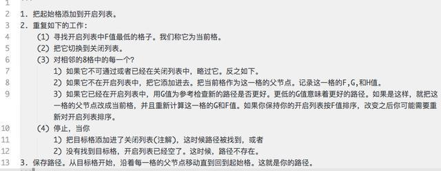
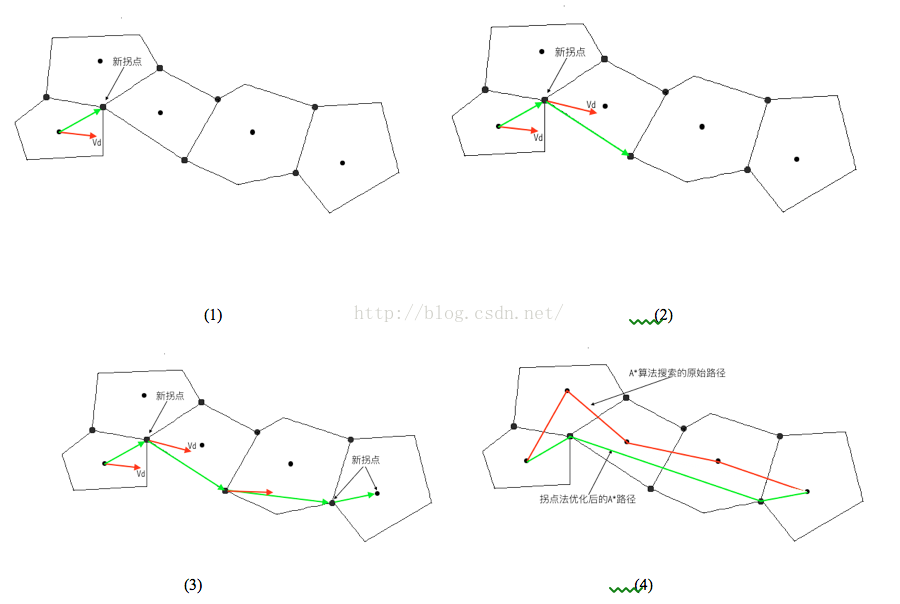
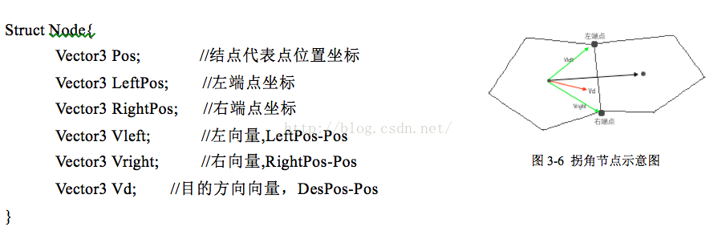

# Game-AI
AI在游戏中是十分重要的，小到路上的NPC，大到ARPG里的BOSS，都离不开AI的加持，那这些AI是怎么实现的呢，这次就来带领大家探索一下。
## 引言
这里有个问题要问一下，AI到底是越强大，还是越聪明，还是越笨越好呢？我认为是越‘笨’越好，如果AI都像Open AI研发的dota那样可以与顶尖人类高手一较高下，那么，对于我们普通人显然还是太难了，同样如果太聪明，那么相对应的游戏性就会下降。我认为目前阶段，可玩性是最重要的，不需要AI去做一些很复杂的东西，但求他们做他们该做的就好。接下来本文会先介绍一些传统的AI编写的方法，在最后稍微介绍一下有关强化学习的内容。大致的内容安排如下：
 - 有限状态机
 - 行为树
 - AStar
 - Unity Navigation System
 - ML and RL
## 有限状态机
### 概念
先来看一下有限状态机在wiki上的定义：有限状态机（英语：finite-state machine，缩写：FSM）又称有限状态自动机，简称状态机，是表示有限个状态以及在这些状态之间的转移和动作等行为的数学模型。  
关键词：状态转移，动作。  
所以，其实状态机就是在不同的条件下转移到不同的状态的机器。回想一下，在游戏中是不是到处都充斥这这些状态，在你离敌人很远的时候，敌人在巡逻，当你靠近敌人时，敌人也向你靠近，当在攻击距离之内的时候，敌人会对你发起进攻，这里敌人一共有三种状态，这些状态的判断依据是你离敌人的距离，这其实就是一个简单的状态机。
### 实现
在具体实现的时候，我建议在写之前画一个状态之间的转移的图或者表，之后照着表写代码，这样逻辑会清晰一些。（不过画图表好像是策划的锅）  
关于有限状态机的实现，有两种实现，一种是简单switch case的实现，相关的框架就像下面这样：
```C
swich：
    case 1：
        do case 1 the thing 
        xxx
        set new state 3
        break;
    case 2：
        do case 1 the thing 
        xxx
        set new state 1
        break;
    case 3：
        do case 1 the thing 
        xxx
        set new state 2
        break;
    ......
```
这样写虽然简单，易写，但是不好维护，特别是在新加入一个状态时，就会很复杂，需要添加新的case，并且在写多之后，这个switch会变得很长，很难维护，所以接下来就有面向对象的方法，首先你需要一个state的基类，然后有一个FSM类来管理和转移状态，所有的状态应该继承state的基类。一个状态类应该需要进入，在运行，结束的函数，一个FSM需要注册状态，状态转移等等函数，具体的实现方法就不细说了，可以
## 行为树
### 概念
当我们的状态是在是太过复杂的时候，使用状态机还是十分的麻烦，因为状态其实并不是像switch case里面那样按照顺序实现的，而是像一颗[决策树](https://zh.wikipedia.org/wiki/%E5%86%B3%E7%AD%96%E6%A0%91)那样，一个一个条件判断过来的，这时我们就可以类比决策树，将其中的决策节点改为状态，这样就形成了行为树，当然真正的行为树会更加复杂，节点也不是都表示着状态，还会有表示其他意义的节点，是一个相对比较复杂的系统。
### 实现
非常惭愧，现还没写过一个行为树，但是这位大佬的博客已经写的博客已经写的很清楚了，这里放个[链接](https://zhuanlan.zhihu.com/p/19890016)
## 寻路
其实严格意义上寻路和上面的状态机并不算是一个层面上的，寻路算是决定状态之后的操作部分，但是因为寻路在游戏中是很重要的，所以说起游戏AI，就一定会提到寻路。比较经典的寻路算法就是A*(读作A star)了，所以接下来会先讲一下A star算法，之后介绍一下unity里面的navigation的实现方法，还会说一下A star的缺点和解决方法。
### A star
A star的第一步就是先保存地图，并且标记可走和不可走的区域，之后将可走的部分分为很多个多边形（这里的多边形指的是凸多边形，下面同样），之后标记每个多边形的中心，作为节点。接下来需要有两个list，第一个叫做open list，用来存储可能在现阶段下一步的可能节点，还有一个close list用来存储已经确定的路径的节点。在某一步时，我们需要做的就是将与目前节点相邻的可达的节点加入open list，之后，我们需要预估open list里面的所有的点，找到最近的路径，那么我们就需要一个判断的条件，用来描述这个最近 ，相对用的公式为F = G + H。想象一下我们现在在A节点，目的地是B，M是A旁边的一个节点，要求解M的F值，那么G是A到M的距离，而H是M到B的距离，G因为和A是相邻的，并且由前面的多边形可知是可以直接求解距离的。问题在如何求解H，即M到B的距离，因为中间很可能是有障碍物的，所以我们不可能直接求解距离，这个距离是需要估算的，这也是后面说A star会出现问题的原因，同时也是A star会被称为启发试算法的原因。关于这个H的计算，有很多的方法。一种是算水平距离加竖直距离，另一种是算直线距离，想象一下，起点和终点之间连一条线，在以这一条线作为斜边来做一个直角三角形，第一种H就是两个直角边的和，第二种H边就是斜边长。这就是A Star的基本思想，在选择方格的时候还需要设置父节点，这样在到终点的时候，直接向前寻找相对应的父节点，一路走过来就是从终点到起点的路，并且在寻路的过程中还需要检查是否可以松弛，具体的完整算法如下：
  
(图片来源：https://www.jianshu.com/p/bb317d02d055)
### 改进Astar->NavMesh
A Star是存在问题的，在多边形中，我们可以使用拐点来优化中心，前面提到，在进行A Star的时候，我们的路线是各个多边形的中心的连线，但是如果我们使用多边形的顶点的话就会少绕一些路，这里看图就可以很明显看出优化的结果：
  
(图片来源：https://blog.csdn.net/cordova/article/details/51607407)  
可以看到，使用多边形的定点就可以很简单的抄近道，优化行走点在多边形中心的A star（其实这里可以想象一下，如果A star的多边形很小很小的话，就基本是沿着最近的路径走了，但是这样的花销就很大，大多边形的计算量小，但是绕的远，而Navmesh在一定程度上优化了大多边形的情况）那么，具体到实现上，该怎么办呢？我们需要三个方向向量，一个是当前指向左端点的，一个同理右端点，还有一个是指点终点的，根据这三个向量的关系就可以选择哪个端点，即看指向终点的离指向左右的哪个近就选择近的那个。有个图，理解一下：
  
(图片来源：https://blog.csdn.net/cordova/article/details/51607407)  
### unity
关于unity的寻路的机制的实现方法，可以在unity的这个[官方文档](https://docs.unity3d.com/Manual/nav-InnerWorkings.html
)看到。基本的思想是先将人物变成圆柱体，之后测试可达区域，再然后进行Navmesh的A star算法寻路，最后还要解决多个同时同路的碰撞问题。
## ML and RL
### 相关术语介绍
 - Agent 游戏主体（玩家）
 - Environment 每个游戏主体应该在一个环境中，简单来讲就是游戏世界
 - State 在每个时刻，游戏主体都会有一个状态
 - Action 这某个状态，主体会采取一个动作
 - Reward 主体才取了一个行动后获得的回报
### 强化学习
强化学习的任务就是教会游戏主体去会获得最高的回报，那么该怎样教他呢？很简单，就像我们人一样，遇到不会的先去试试，如果发现是坑，下次就换个路走。所以我们的强化学习的过程就是，在某个state，采取某个action，获得reward，这样积累经验，到最后遇到某个state的时候，就会采取收益最大的action。当然真正的枪换学习没有这么简单，具体的可以看我翻译的unity AI_agent的博客：
[第一篇](https://lookcc.github.io/2018/03/28/Unity-AI-1/),[第二篇](https://lookcc.github.io/2018/03/29/Unity-AI-2/)。
## 总结
这次从状态机到行为树，再到比较底层的寻路算法，还有最近兴起的强化学习，给大家大致说明了一些游戏AI的实现方式，当然，这里还有很多的东西，比如集群的实现（想象刺客信条的大街上的一群的NPC，包括其他游戏中的一群动物等等），他们不仅要自己有AI，还有群体之间的关系。同样，再具体到游戏和工业中，针对不同的游戏，也会有不同的AI，很多的游戏AI其实都是”开挂的“，比如CSGO里面。bot是知道你在哪里的，还有很多的AI的难度是假的，很多的游戏都有简单，普通，困难等等的难度选择，但是在很多的程度上并不是AI聪明了，而是强行提高的难度，这里还是CSGO的例子，bot的难度不同，改变的只是bot的打枪的精准度，在策略和意识上，他们还是很傻。  
不管怎么说，AI还是有很长的时间要走。
