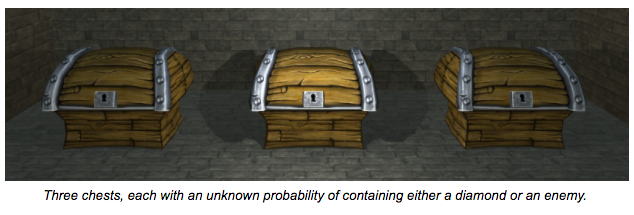

在ML大火的年代，在OpenAI使用训练的AI在dota2上击败人类的职业选手时，ML，或者更加细致的说RL(Reinforce Learing 强化学习)在未来将会变成游戏开发不可或缺的一部分，而unity引擎也在自己的引擎中加入了相关的模块，官网上也放出了很多的博客，但其中有很多强化学习的术语，对游戏开发者不是很友好，这里就翻译一下为RL尽自己的棉薄之力，原文在[这里](https://blogs.unity3d.com/cn/2017/06/26/unity-ai-themed-blog-entries/)
# 有关unity AI的一系列博客
## 这一系列博客是为谁写的
我们主要的目的是告诉unity游戏开发者们怎样在游戏中使用AI和ML，我们也想告诉艺术家在内容创作上也可以使用AI。我们还想告诉向ML开发者unity是一个很有潜力的AI开发、研究平台。这包括机器人和自驾车模拟平台的行业潜力。最后让更多的学生和爱好者同时AI和Unity感兴趣。  
在接下来的几个月里，我们希望使用这个地方来讨论并且家里一个围绕这些内容和在unity中使用AI的样例的社区。Unity团队的多名成员以及相关的其他相关unity团队包括unity将在此讨论unity与机器学习之间的不同联系。只之后，我们将发布开源工具，视频和示例项目，以帮助上述不同群体使用我们分享的想法，算法和方法。我们将密切关注这一空间，并鼓励unity社区为评论做出贡献。
## 为什么使用ML
在正文开始之前，我们希望在第一个部分讨论ML和game AI的关系。大多数的现在存在的游戏AI是手敲出来的，包括有时候会有上千条规则的决策树，这些都需要使用手动编写代码的方式来编写和测试，相反，ML依赖于可以不经过专家翻译而理解原始数据的算法。
拿机器视觉里面的分了问题做一个简单的例子，在几年前，研究者需要手动编写过滤器来根据图像的特征分辨是一只猫或者是一只狗。相反的，在机器学习里使用新的深度学习的方法，只需要图像和相对应的标签就可以自动学习特征。我们相信这种自动学习的方法可以帮助我们简化并加速大小游戏的开发，同时也能使unity在更广范的范围使用，比如ML场景的模拟。  
这种自动学习可以在很多的场景中使用，比如NPC行为。我们可以利用强化学习来训练代理人，代理人可以评估在一个环境中采取哪些行为，当他们被训练之后，这些代理人会采取会获得最大收益的行为，而不是去编程如何行动。这篇博客下面将包含一个简单的强化学习的介绍并且介绍怎样在unity实现一个简单的机器学习算法。这篇博客用到的代码在[github的仓库里](https://github.com/Unity-Technologies/BanditDungeon)，你也可以在这里看一个网页版的[Demo](http://awjuliani.github.io/Bandit/)。
## 强化学习-多臂赌博机
上面已经提到，强化学习的一个核心就是关于价值的评估，并且根据评估的价值行动，在继续下去之前，介绍一些术语会比较有用。在强化学习中，执行动作的是叫代理人，他改变行为的决定被称为一个策略，代理人总是在一个环境中，并且每个时刻代理人会在一个确定的状态，在状态中他会选择集合中的一个行为。一个给定状态的的价值是指在这个状态最终会获得多少回报，在一个状态采取一个行为将会使代理人进入一个新的状态，或者提供奖励，或者两者都有（采取一个行为不一定就会进入下一个状态）。最终会获得的总奖励将会是代理人在强化学习中试图最大化的。
  
一个强化学习的简单的例子是多臂赌博机，这个名字来源于多个老虎机的优化问题，被称为多臂赌博机。在这个例子中，环境里只有一个状态，代理人有n个行为，代理人的每个行为都会立刻得到一个回报，代理人的目标是学习选择获得最大的回报的行为。  
为了更具体的描述，让给我们想象一个游戏场景，代理人进入一个房间，发现墙边放了一排的箱子，每个箱子都有一个概率获得一个幽灵(-1)，或者一个钻石(+1)。  
代理人的目标是去学习哪个箱子会有最大的概率得到钻石，很简单的放方法就是去试，看看哪个箱子有最大的概率获得钻石，事实上在代理人充分了解世界和最佳行动之前，强化学习就是简单的实验和错误。将上面的例子带到强化学习中，对应每个箱子的试验就是才取一系列的行为（多次打开箱子），学习对应的就是每次更新对每个箱子的回报值的评估，一旦我们已经确定我们对每个箱子的回报值评估，我们就可以让代理人一直选择估值回报最大的行为。  
  
这些价值估计可以通过一个迭代过程来学习，我们从初始的一系列估计$V(a)$开始，然后在每次采取行动并观察结果时调整它们。公式可写为：  
$$V(a) = V(a) + \alpha * (r - V(a))$$
$\alpha$ 代表我们的学习速率，$V(a)$ 是给定一个动作的估值，$r$是采取这个动作后立刻得到的回报。  
我们可以从上面的公式直观的看到，我们每次针对现在的值向着获得的值的方向做一个微小的调整，在这种情况下，我们保证每次我们的估值都在朝着环境的真实状态调整，这样做也同时能保证我们的估值不会无缘无故的变大（如果我们只还算积极的结果就会发生无缘无故变大的情况），具体到代码中，我们可以通过维护一个估计值的向量来实现。不同的位置代表着我们采取的不同的行为。这里有一个[视频](https://www.youtube.com/watch?v=SmZ5DB0zon4)演示上面提到的Demo，最左边获得钻石的概率为10%，接下来为20%,80%，最后学习出的概率是比较准确的。  
## 多臂赌博机拓展
上面的情景与真实环境有一个很大的不同：他只有一个状态。在现实中（或者在任何一个游戏世界中）一个给定的环境可以成千上万个可能的状态，每个状态都有他们独特属性，这些属性描述着动作带来新的回报或者两个状态之间的转移。比如，我们要调整我们的行为，拓展我们的价值估计以及状态。注意，现在我们将使用$Q(s,a)$来代替$V(a)$，抽象的说，这意味着我呢期望得到的回报不仅是动作的函数，而且还是状态的函数，在上面的情境中，状态可以是很多的房间很多的盒子，每个房间的箱子都是不同的，那么我们的代理人就要在不同的的房间采取不同的策略。我们此时可以使用一个矩阵来代替上面的向量，这个矩阵是这样的[状态，行为]
## 探索和利用
在RL里还有一个很重要的问题。在我们的代理人已经学了一个策略期去获得最大回报之前，他需要一个策略来使他在整个世界中学到最佳的策略，这提出了如何平衡探索（不断地试验了解世界）和利用（选择当前最佳动作）。有时他们是一致的，但是大多数是不一致的，有很多的方法来使这两个平衡，下面叙述了几种方法。  
- 一个简单的方法，有用的策略的标准是“乐观面对不确定性”，这里的方法是代理人开始于高的评分$V(a)$在每次选择动作的时候，之后贪婪（每次都选择高的）这将导致每个动作至少探索一次，但是这样的话加入对一个估值一次，得到的值很低，但是事实上它的真实值可能很高（因为只探索了一次，所以就不能代表真实）所以这种启发式的方法通常还不够，我们需要找到一个不经常使用但是估值很高的动作。
- 另一个策略是在每个行为的估值上面加噪声，之后在这些带噪声的估值上面使用贪婪算法，采用这种方法，只要噪声小于真正的最佳方法和其他的方法的值的差值，最后将收敛到最佳值。
- 我们还可以更进一步，将价值估计与概率关联。在这种情况下，如果每个行动的价值估计大致相等，那么我们会以相等的概率采取行动。另一方面，如果一个行动有更大的价值估计，那么我们会更频繁地选择它。通过这样做，我们会最后地消除了估值小的行为。我们上面的Demo用的就是这种方法
- （译者：这里再介绍一种方法，原文没有这种方法，不过和第三种类似）我们可以设置一个贪婪值$\epsilon$,这个值表示我们贪婪的概率，即我们以$\epsilon$的概率贪婪，以$(1-\epsilon)$的概率探索。这个$\epsilon$一般取0.9。
## 继续前进
（这里面都是像开头一样的客套话我就把大致意思翻译一下）  
通过上面的博客和附带的代码，应该已经了解了强化学习，下面还有Q-Learning算法，结合深度神经网络的方法等等帮助你实现更加复杂的AI。以后还会支持tensorflow和pytorch框架（这里点个赞）。希望大家加入我们。 
