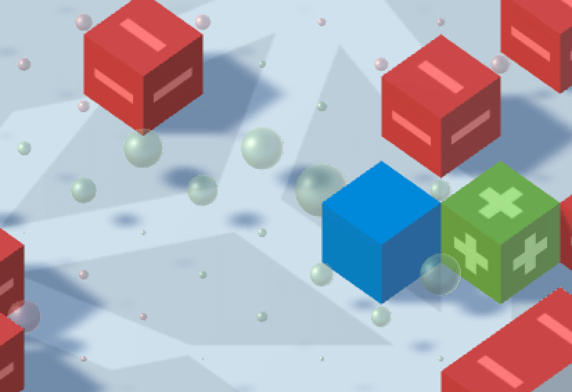

# Unity AI-使用Q-Learning进行强化学习
欢迎来到unityAI的系列博客的第二篇，在这篇，我们将把上次没讲的补上，并且讨论如何实现一个拓展的多臂赌博机，并且将应用到一个强化学习问题中。在学习的过程中，我们将训练一个根据Q值表在特定的环境选择特定行动的代理人，对于这个例子，我们仅仅使用一个简单的格子世界和一个Q值表，幸运的是这种基本的方法适用于大部分游戏。如果你想试一下Q-Learning的Demo，请点击[这里](http://awjuliani.github.io/GridGL/)。更加详细的Q-Learning的讲解请看下面的解释。
## Q-Learning算法
### 回顾拓展的多臂赌博机
强化学习的目的是训练一个能在一个给定的环境中学习怎样行动使自己在未来得到最大的回报。在上次的博客里，这个环境是相对静止的。并且只有三个房间里面的箱子，然后选择哪个箱子打开。我们的算法学习了每个状态-行为对的Q环境，以后将根据这个Q函数对应期望的回报来行动。我们称这个问题为“拓展的多臂赌博机”。  
### 强化学习问题
拓展的多臂赌博机与真正的强化学习问题之间还差两件事，稀疏的奖励和状态之间的转换。代理人不一定会每次行动都会得到回报。并且很多时候有些回报是延迟的，因为在某些情况下最佳行动不是立刻给出的，在很多的步之后可能才会出现最佳行动，更具体的来讲，代理人会可能走的是正确的路径，但是只有在最后才能获得奖励，而不是在沿途的每一步都会获得奖励。这些步都可能对最后获得的奖励起着至关重要的作用，尽管在当时没有立即的奖励。我们需要一些回报分配机制，使他在前面那些步骤也能得到回报。  
另一个问题就是完整的强化学习中状态之间是可以相互转换的，我们的行为不仅会获得回报函数$R(s,a)\Rightarrow r$，还会产生新的状态，根据一个状态转移函数，$P(s,a)\Rightarrow s\prime$.一种简单的例子就是在一个路上每走一步就会到这一条路的下一步的状态，因此我们不仅希望我们的代理人学到采取现在最优的动作，还需要去有着更大回报的状态。
### bellman更新
上面添加的两个元素看起来是没有关系的，但他们其实是直接相关的，他们都连接着我们的代理人会在未来的哪个状态停止和未来会获得多少回报。我们可以利用这种关系学习这些情况下的最佳行动。换句话说，在真正的Q函数下现在的状态的值和动作可以被分解为现在的立刻的回报乘代理人在下一个状态的可以获得的回报最大值再乘以一个折扣因子，公式就变为:

$$\gamma max_{s\prime}Q^*(s\prime,a\prime)$$

这叫做bellman等式，可以被写成下面的样子:

$$Q^\ast(s,a)=r+\gamma max_{s\prime}Q^\ast(s\prime,a\prime)$$

这里$\gamma$(gamma)是一个折扣因子，代表着我们希望我们的代理人在多大程度上关心未来的可能的奖赏。如果我们在设置为1.0，那么我们的代理人将会同等重要的关心未来的奖赏，如果不停的训练，最后的估值将会无穷大。综上我们一般设置这个值小于一，一般在0.7到0.99。  
bellman方程是十分有用的，因为它提供了一种从Q函数自身更新的方法。$Q^*(s,a)$指的是一个最优的Q值，但是在现在的状态，下一个状态的次优解能更精确的预测现在的Q值。因为我们主要主要依据每一步的真是奖赏，所以，我们相信Q值会缓慢的提高。我们可以利用bellman等式将Q-Learning的更新写成如下的形式

$$Q(s,a)=Q(s,a)+\alpha(r+\gamma max_{a\prime}Q(s\prime,a\prime)-Q(s,a))$$

这看起来很像我们在前面的关于多臂赌博机的更新函数，差别在我们这次还考虑了在下一步可以获得的回报（相等于提前看了一步，前面的那个每一步的状态是一样的，所以根本不要要考虑，相等于独立重复抽样）。
### 探索
为了保证我们的代理人已经做了适当的探索，我们将使用一种小步贪婪的方式。为了使用小步贪婪，我们先设置$\epsilon$为1.0，然后在代理人每次采取行动后减小一点。在代理人采取行动时，他要么选择$argmax(Q(s,a))$，贪心行为，或者根据$epsilon$选择一个随机的行为。这样会导致在刚开始的时候Q的估值很低，但是随着对世界的了解和$\epsilon$的降低，Q函数会逐渐对应于环境中真实的Q值，我们根据这个选择的动作会越来越精确。
### Unity像素世界

蓝色的代表代理人，红色的代表障碍物，绿的代表目的地。绿色和红色的球体代表着网格世界中的每个状态的估值。   
为了演示Q-Learning的代理人，我们使用了unity建立了一个简单的像素世界。这个环境有着下面的这些东西，1.随机放置的代理人，2.随机放置的目的地，这个目的地是我们希望我们的代理敌人能够学会走过去的，3.随机放置得的障碍物，我们希望我们的代理人学习避开这些障碍物。状态是一个与网格位置相关的整数，四个动作是向上向下向左向右，回报就是，当移动到了目标位置获得+1。移动到障碍物为-1，每走一步-0.05。每个循环在移动到目的地或者障碍物，或者达到100步时停止。向前面的教程一样，代理人的Q值会存在一个表里，行代表状态，列代表可能的行为。你可以在[这里](http://awjuliani.github.io/GridGL/)，在你的浏览器上玩这个demo。或者在[这里](https://github.com/Unity-Technologies/Q-GridWorld)下载这个unity工程用在你自己的游戏中。在学习的过程中，每个地方将会出现彩色的球，这代表着代理人在这个状态的Q估值，一旦代理人学到了最优的策略，我们可以看到将会有一个直接的值梯度从开始到目的地。 
## 继续向前
（还是像前一篇一样，主要传达意思，就不一句一句的翻译。）
更强的DQN，玩ATARI游戏，通过像素学习。以后将开放DQN接口。还有另一个demo的视频，在[这里](https://www.youtube.com/watch?v=fiQsmdwEGT8&t=2s)