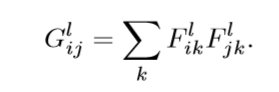

# iamge style transfer
这次AI轮到我分享，刚好这次任务是有关提箱风格转换的，我就分享一下这方面的几篇论文，大家一起学习一下。
## 论文
A Neural Algorithm of Artistic Style    2015  
Image StyleTransfer Using Convolutional Neural Networks 2016  
  
Perceptual Losses for Real-Time Style Transfer and Super-Resolution 2016  
Texture Networks: Feed-forward Synthesis of Textures and Stylized Images  2016  
  
Deep Photo Style Transfer  2017  
上面是这几年中在这方面比较重要的几篇论文，我把它们分成三个部分，首先是前两篇，他们是同样的人写的，区别是第一篇不详细，第二篇比较详细。之后的两篇是对第一篇的方法的改进，大大加快了出图的时间，最后一篇是解决原来的方法出的图想画的问题的，具体的实现方法后面会讲。

## A Neural Algorithm of Artistic Style    2015
## Image StyleTransfer Using Convolutional Neural Networks 2016 

### 定义输入和输出
前面说过，这两篇讲的是一个东西，只是15年的时候他们的paper讲的不够清楚，在16年他们又发了一篇用来详细的叙述他们的模型。
他们的模型是这样的，首先是输入，输入是两张图片，一张为content，一张为style，即一张为待优化的内容图片，一般是一张照片；另外一张为风格图片，用来体现纹理，一般是一张画。（严格来说应该还有一张图片，是一张用来初始化的噪声图片，不过经过他们的实验，使用style或者content或者噪声图片都可以达到基本相同的结果）接下来是输出，输出就是一张图片，这张图片在内容上像content图片，在风格上像style图片。
### 内容损失函数

先来看这个东西，我们定义这个为第l层卷积，第i个filter，第j个位置的数字，这里第i个filter应该是一个m×n的二维的一个矩阵，j应该是指将这个reshape为一个行向量（或者一个列向量）的位置j。明白了这个的意思后，我们来看代价函数。

这里的P是content图像，F是正在优化的图像。很明显这是用的欧式距离。将其求导并加以激活函数可以得到下面的式子。

### 风格损失函数
#### Gram矩阵
首先我们需要讲一下这个我们该如何描述风格这个东西，这个时候我们就需要用到这个叫做Gram的矩阵，先看一下G的定义

其中关于F的那三个位置的信息和上面的是一样的，那么这个G就表示在第l卷基层，第i个filter和第j个filter的对应位置的乘积的和，换句话说就是把filter化为一个行向量然后做内积。那么可以想象，这个描述的不就是不同的filter之间的关系么？而而这些不同的关系中就可以理解为蕴含着纹理的信息。
#### 损失函数
有了G的定义，参照之前的公式，我们使用欧式距离可以很快的得出风格的损失函数。

这里N和M适合图像大小，卷积层数有关的常数。w是一个权值，代表不通卷积层的权值，同理求导激活之后（这里他们的W取了F）

### 总损失函数
将风格损失函数和内容损失函数线性相加之后，就可以得到总的损失函数，

### 模型
他们使用了VGG19的模型用来训练，具体的可以看这张图。

这里的所有的公式我前面都讲过了，关于这张图，我只讲一个东西。我们可以看到，在纹理这一边，我们是每一个阶段完成后都会进行迭代，而在右边内容图片这里，只有在第四层才进行迭代，这里认为是这样的，纹理在多层进行迭代是因为他需要挖掘在深层次的关系，而像素只在一层迭代是因为它只需要在像素的方面像原图像即可。

## Texture Networks: Feed-forward Synthesis of Textures and Stylized Images

这一篇主要对第一篇进行了速度上的优化，以及研究了纹理生成的问题，其实，第一篇就有纹理生成的内容，假如我们遮住右边，只让它优化style的内容，那么就会成纹理。
### 代价函数
#### content

#### style

这个和第一篇是一样的，具体就不在赘述。
### 总的代价函数
#### 生成纹理

#### 风格转换

这两个公式也十分简单，就是最小化之前的代价函数，只是在风格转化时多了一个关于内容的损失函数。
### 不同
到这里为止，这篇的代价函数的定义和最小化等等，都和第一篇是一样的，那么不同点是什么呢？  
在计算的时候，借用已经训练好的模型，也就是说，它借用已经训练好的用来做分类的vgg19的模型，在那个模型里面计算loss。即用别人训练好的一个模型计算loss来优化自己的一个向前传播的模型。
### 模型

左边的是他自己的模型，右边是就地使用的别人的训练好的模型，在这里就是VGG19。

## Perceptual Losses for Real-Time Style Transfer and Super-Resolution 2016

这一篇是对第一篇进行优化，并进一步探讨了关于超清分辨率重建的问题（这次是对image style transfer，所以分辨率重建部分先不讲）  
他们优化的主要方法是建立自己的模型，使用残差网络等等来进行优化。
### 代价函数
#### 内容损失

#### Gram矩阵

#### 风格损失

公式在表示形式虽然和第一篇有些不一样，但是表达的意义是一样的。
### 优化方式

最后一项是全变差正则化（全变差正则化一般用在信号去噪）让图片更平滑。
### 不同
#### 和第一篇的不同

很显然，他的思想和前面的第二篇的思想是一样的，使用别人训练好的模型来计算loss。
#### 和第二篇的不同
第二篇是训练了一个自己的网络，使用了向前传播的方法.而第三篇也是一个自己的向前传播的网络，但是中间他用了很多残差网络，也就是说fw不同。

Deep Photo Style Transfer  2017  

这个篇在模型上和第一篇是一样的，但是在公式上存在着一些变化，他加入了正则项来防止图像的扭曲，同时使用语义分割的方法来使图像看起来合理。
### 回忆以前公式

### 加入正则项
在第一篇论文出现的图里面，照片已经不再是照片了，而是像一张画，即使是使用两张照片合成，还是会有很多的扭曲，为了解决这个问题，他们加入了一个正则项，

首先来解释一下这个公式里面符号的含义，求和的里面c表示通道，也就是对三通道求和，然后是V[o]，这个是将一个通道reshape为列向量，而这个M是用一篇论文里的方法（A Closed Form Solution to Natural Image Matting）j计算出的拉普拉斯抠图法的矩阵。(这一点由于没有去看那篇paper，我也不是很懂，但单从公式来看，还是可以理解为想让它在像素点上像原照片)  
求导后为

### 加入语义分割
首先说一下为什么要加入这个函数，因为前面的都是无差别的风格转换，这样存在的问题是：不能很好地反应实际的情况，比如，我的图片现在有高楼和天空，那么我当然是希望天空学习style的天空，高楼学习style的高楼，而不是将天空学习成高楼的style。接下来看一下他们是怎样解决这个问题的。

这个是加入语义分割后的风格转化函数，我们可以看到其实除了F需要在原来的基础上乘以一个M之外，其他的都一样，这个M可以理解为一个Mask，一个遮罩，在转化天空的时候，就遮住其他的部分，这样就可以解决问题了。但是又有一个新的问题出现了，那便是，我们怎么知道这是天空呢？这里他们人为的建立了几十个标签，输入的图片所含信息必须包含在这些标签中。（我觉得这个以后应该需要改进，这个方法局限性很大）
### 优化

这里的C就是前面回忆那里的C代价函数，S+就是加入了语义分割的函数，最后的正则项就是前面提到的正则化。

## 趋势
### 总结一下这三年的趋势
#### 2015提出基本方法
#### 2016提高速度
#### 2017提高图片的真实度

